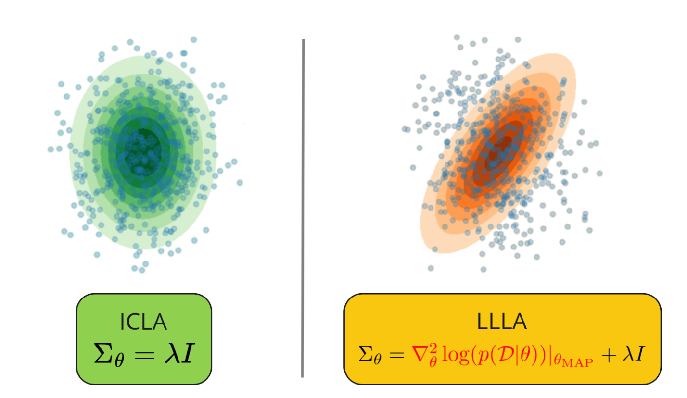

# Identity Curvature Laplace Approximation
<p align="center">
    
</p>

This repo contains official implementation of 
**[Identity Curvature Laplace Approximation for Improved Out-of-Distribution Detection](https://arxiv.org/pdf/2312.10464) [WACV 2025]** by Maksim Zhdanov, Stanislav Dereka and Sergey Kolesnikov.
The implementation is based on [OpenOOD](https://github.com/Jingkang50/OpenOOD).


## Preparing the environment

1. Build Miniconda environment from `env_laplace.yml` by running `conda env create -f env_laplace.yml`.
1. Alternatively, you can build Docker image from `Dockerfile`.
2. Additionally, you need to install `asdfghjkl` backend by running `pip install git+https://git@github.com/wiseodd/asdl@asdfghjkl`.
3. Download the datasets:
```shell
bash /scripts/download/download.sh
```

**Note.** If some links in `download.sh` are broken, 
download the datasets by yourself from the official
repositories and refer to `./scripts/imglist_generator.py`
to prepare image lists in OpenOOD format.

## Reproducing the results

As we use [wandb](https://wandb.ai/) as a monitoring tool, you need to set wandb environment variables in *.env* file:

```shell
WANDB_API_KEY=<YOUR_KEY>
```

**Note**: ICLA and LLLA variant are all post-hoc methods which do not require any training.

**Note**: all the experiments on `cifar10`, `cifar100`, `imagenet-200` are guaranteed to run on a single Nvidia A100 GPU.

### Evaluation script parameters of interest

In evaluation *.sh* scripts, you can tweak the following parameters:

1. `EXP_NAME='name'` - the name of your experiment in Wandb.
2. `export CUDA_VISIBLE_DEVICES=0` - ID of your CUDA device. 
3. `--postprocessor.postprocessor_args.llla_type 'type'` - type of Laplace Approximation to use. Supported variants are `ef`, `ggn`, `k-fac` and `icla`.
4. `--postprocessor.postprocessor_args.optimize_precision true` - optimize prior precision or not. This corresponds to ICLA and ICLA (zero) algorithms in the paper.
5. `--recorder.project icla` - the name of your Wandb project.

Run one of the following commands to reproduce the results from the paper. 
You can use LLLA with EF, GGN, K-FAC or ICLA (ours).

### CIFAR-10 

**Empirical Fisher (EF)**
```shell
bash scripts/ood/icla/cifar10_llla_ef_eval.sh 
```
**Generalized Gauss-Newton (GGN).=**
```shell
bash scripts/ood/icla/cifar10_llla_ggn_eval.sh
```
**Kronecker-Factored Approximate Curvature (K-FAC)**
```shell
bash scripts/ood/icla/cifar10_llla_kfac_eval.sh
```
**Identity Curvature Laplace Approximation (ICLA)**
```shell
bash scripts/ood/icla/cifar10_llla_icla_eval.sh
```
**Identity Curvature Laplace Approximation (ICLA) with Precision Zero Hessian Optimization**
```shell
bash scripts/ood/icla/cifar10_llla_icla_zero_eval.sh
```

### CIFAR-100

**Empirical Fisher (EF)**
```shell
bash scripts/ood/icla/cifar100_llla_ef_eval.sh 
```
**Generalized Gauss-Newton (GGN)**
```shell
bash scripts/ood/icla/cifar100_llla_ggn_eval.sh
```
**Kronecker-Factored Approximate Curvature (K-FAC)**
```shell
bash scripts/ood/icla/cifar100_llla_kfac_eval.sh
```
**Identity Curvature Laplace Approximation (ICLA)**
```shell
bash scripts/ood/icla/cifar100_llla_icla_eval.sh
```
**Identity Curvature Laplace Approximation (ICLA) with Precision Zero Hessian Optimization**
```shell
bash scripts/ood/icla/cifar100_llla_icla_zero_eval.sh
```

### ImageNet-200

**Empirical Fisher (EF).**
```shell
bash scripts/ood/icla/im200_llla_ef_eval.sh 
```
**Generalized Gauss-Newton (GGN).**
```shell
bash scripts/ood/icla/im200_llla_ggn_eval.sh
```
**Kronecker-Factored Approximate Curvature (K-FAC).**
```shell
bash scripts/ood/icla/im200_llla_kfac_eval.sh
```
**Identity Curvature Laplace Approximation (ICLA)**
```shell
bash scripts/ood/icla/im200_llla_icla_eval.sh
```
**Identity Curvature Laplace Approximation (ICLA) with Precision Zero Hessian Optimization**
```shell
bash scripts/ood/icla/im200_llla_icla_zero_eval.sh
```

## Citing

If you used this code for your research or a project, please cite us as:

```
@misc{zhdanov2024identitycurvaturelaplaceapproximation,
      title={Identity Curvature Laplace Approximation for Improved Out-of-Distribution Detection}, 
      author={Maksim Zhdanov and Stanislav Dereka and Sergey Kolesnikov},
      year={2024},
      eprint={2312.10464},
      archivePrefix={arXiv},
      primaryClass={cs.LG},
      url={https://arxiv.org/abs/2312.10464}, 
}
```

